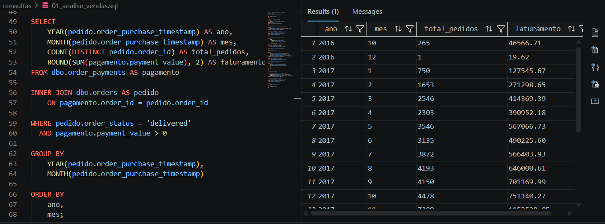
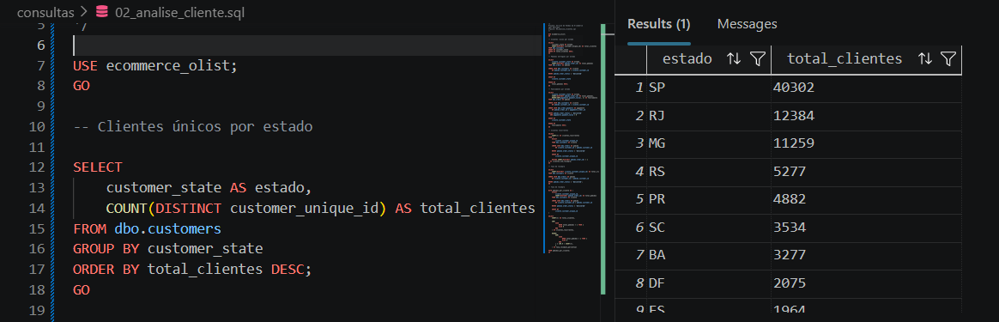
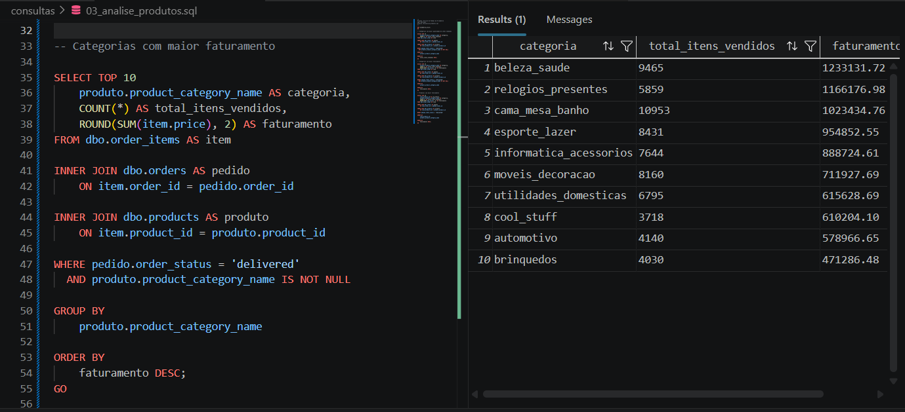
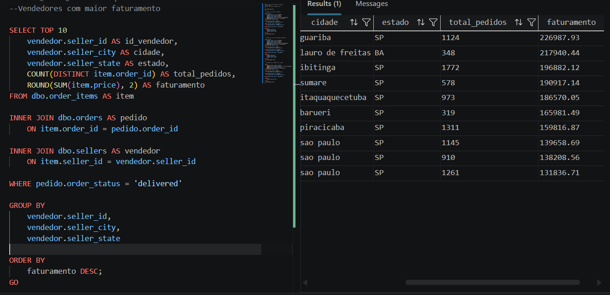
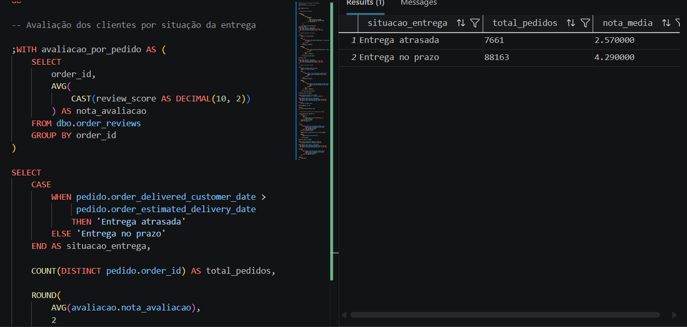
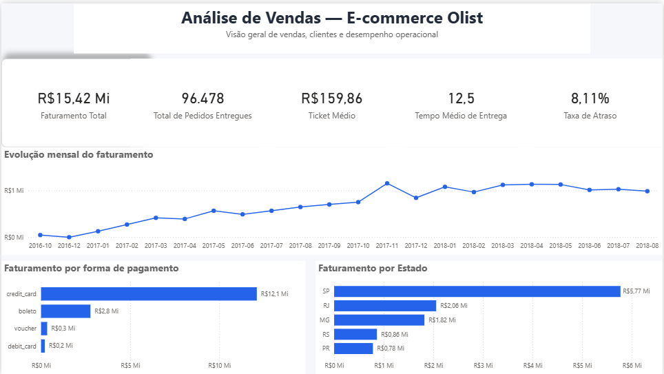
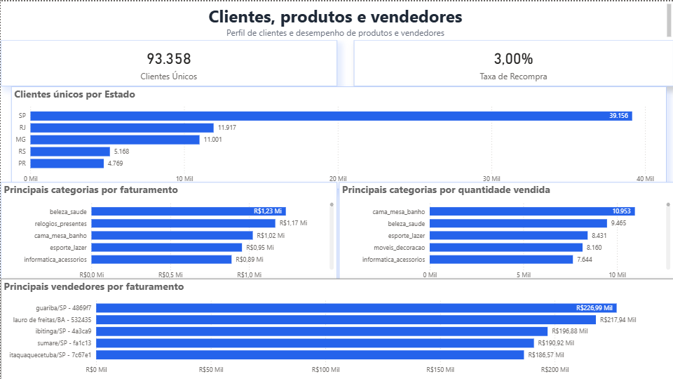
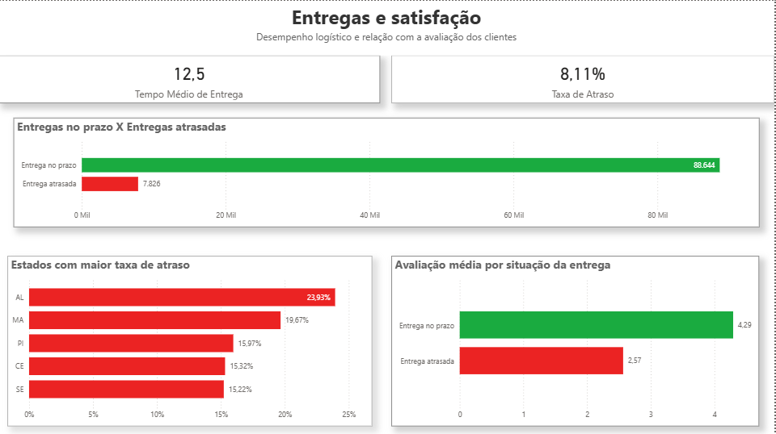

# Análise de Vendas em E-commerce com SQL Server

Projeto de análise de dados desenvolvido com SQL Server utilizando dados públicos
de e-commerce da Olist.

O objetivo é praticar SQL aplicado a um cenário de negócio, analisando vendas,
clientes, produtos, vendedores e entregas.

## Objetivo

Utilizar SQL para organizar e analisar dados históricos de um e-commerce,
buscando responder perguntas comerciais e operacionais.

Entre as perguntas analisadas estão:

- Qual foi o faturamento total?
- Quantos pedidos foram entregues?
- Qual foi o ticket médio?
- Como as vendas evoluíram ao longo do tempo?
- Quais estados possuem maior volume de pedidos?
- Quais categorias de produtos tiveram maior faturamento?
- Quais vendedores apresentaram melhor desempenho?
- Qual foi o tempo médio de entrega?
- Quantos pedidos foram entregues com atraso?
- Pedidos atrasados apresentam avaliações menores?

## Tecnologias

- SQL Server
- SQL
- Python
- Visual Studio Code
- Git
- GitHub

## Dataset

Foi utilizado o dataset público **Brazilian E-Commerce Public Dataset by Olist**.

O conjunto de dados contém informações sobre:

- clientes;
- pedidos;
- produtos;
- vendedores;
- itens dos pedidos;
- pagamentos;
- avaliações.

Os arquivos CSV originais não são armazenados neste repositório.

## Estrutura do projeto

```text
analise-vendas-ecommerce-sql-server/
│
├── dados/
│   ├── brutos/
│   └── tratados/
│
├── documentacao/
│   ├── case_negocio.md
│   ├── modelo_dados.md
│   └── insights.md
│
├── scripts/
│   ├── 01_criacao_banco.sql
│   ├── 02_criacao_tabelas.sql
│   ├── 03_importacao_dados.sql
│   └── 04_validacao_dados.sql
│
├── consultas/
│   ├── 01_analise_vendas.sql
│   ├── 02_analise_clientes.sql
│   ├── 03_analise_produtos.sql
│   ├── 04_analise_vendedores.sql
│   └── 05_analise_entregas.sql
│
├── utils/
│   └── tratar_reviews.py
│
├── imagens/
├── .gitignore
└── README.md
```

## Conceitos SQL utilizados

Durante o projeto foram utilizados conceitos fundamentais de SQL, como:

- `SELECT`
- `WHERE`
- `ORDER BY`
- `GROUP BY`
- `HAVING`
- `COUNT`
- `SUM`
- `AVG`
- `ROUND`
- `DISTINCT`
- `INNER JOIN`
- `CASE WHEN`
- CTE
- `TOP`
- `CAST`
- Funções de data como `YEAR`, `MONTH` e `DATEDIFF`

## Principais resultados

A análise permitiu identificar alguns indicadores relevantes:

- **96.478 pedidos entregues**
- **R$ 15,42 milhões em faturamento**
- **R$ 159,86 de ticket médio**
- **12,5 dias de tempo médio de entrega**
- **8,11% de taxa de atraso**
- **3,00% de taxa de recompra**

Entre os principais resultados encontrados:

- São Paulo apresentou o maior volume de clientes, pedidos e faturamento.
- `cama_mesa_banho` foi a categoria com maior quantidade de itens vendidos.
- `beleza_saude` apresentou o maior faturamento entre as categorias.
- O vendedor com maior número de pedidos não foi o mesmo com maior faturamento.
- Pedidos atrasados apresentaram nota média de **2,57**.
- Pedidos entregues no prazo apresentaram nota média de **4,29**.

Os resultados e interpretações estão detalhados em
[`documentacao/insights.md`](documentacao/insights.md).

## Evidências da análise

### Evolução do faturamento mensal



### Clientes por estado



### Categorias com maior faturamento



### Vendedores com maior faturamento



### Entrega e avaliação dos clientes



## Dashboard em Power BI

Além das análises realizadas em SQL, foi desenvolvido um dashboard no Power BI conectado ao banco de dados SQL Server.

**Arquivo do dashboard:** [Baixar relatório Power BI (.pbix)](PowerBI/analise_vendas_ecommerce_olist.pbix)

O relatório foi dividido em três páginas:

- **Visão Geral:** principais indicadores de vendas, evolução mensal do faturamento, formas de pagamento e desempenho por estado.
- **Clientes, Produtos e Vendedores:** análise de clientes únicos, recompra, categorias de produtos e desempenho dos vendedores.
- **Entregas e Satisfação:** análise do tempo de entrega, atrasos e relação entre desempenho logístico e avaliação dos clientes.

### Visão Geral



### Clientes, Produtos e Vendedores



### Entregas e Satisfação



## Etapas do projeto

1. Definição do problema de negócio
2. Estruturação do banco de dados
3. Criação das tabelas
4. Importação dos dados
5. Tratamento do arquivo de avaliações
6. Validação dos dados
7. Análise de vendas
8. Análise de clientes
9. Análise de produtos
10. Análise de vendedores
11. Análise de entregas
12. Documentação dos principais insights

## Status

Projeto em desenvolvimento.

---

Desenvolvido por **Igor Henrique**